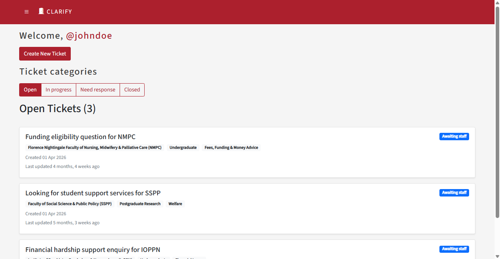

# Clarify - Student Query Ticketing System

Clarify is a ticketing platform for managing student support queries.
Students can submit and track requests, while staff can sort, claim, prioritise and collaborate on tickets through role-specific workflows.

The system also supports email ticket creation, notifications, attachments, issue grouping and automated ticket lifecycle tasks.

**Live demo:** https://clarify.pythonanywhere.com



## Live Demo

A deployed version of Clarify is available at:

https://clarify.pythonanywhere.com

### Demo accounts

**Student:** `@johndoe`, `@janedoe`, `@charlie`, `@student001`

**Staff:** `@staff001`, `@staff002`

**Password:** `Password123`

These accounts contain demo data only and are provided so visitors can explore the student and staff workflows.

## Key Features

- Role-specific workflows for students, staff and administrators
- Ticket creation, claiming, prioritisation and status management
- Search, filtering, sorting and pagination across ticket dashboards
- File attachments and access-controlled downloads
- Public comments and staff-only internal notes
- Issue groups for linking related student queries
- Email ticket creation and classification
- Outbound email notifications for ticket activity
- Automated reminders and closure of inactive tickets
- Staff preferences and configurable ticket visibility

## Engineering Highlights

- **586 automated tests** covering models, forms, views, permissions, workflows and email behaviour
- **99% minimum test coverage enforced in CI**
- GitHub Actions for continuous integration and scheduled background tasks
- Reproducible development environment using Nix
- Production deployment on PythonAnywhere
- Environment configuration for production secrets
- Role and ownership access controls for tickets and attachments

## Tech Stack

**Backend:** Python 3.12, Django

**Frontend:** Django templates, HTML, CSS, JavaScript

**Database:** SQLite for local development

**Testing:** Django TestCase

**CI / Automation:** GitHub Actions

**Development environment:** Nix

**Deployment:** PythonAnywhere

## Project Context

Clarify was developed as a **King's College London Software Engineering Group Project** by a team of six students.

### Team

- Patrick Dunham
- Darren Guan
- Aliaa Mostafa
- Gor Vardanyan
- Bingyan Yang
- Chen-Han Yen

## Local Setup

Full development setup instructions are available in [`docs/setup.md`](docs/setup.md).

### Quick start

```bash
python3.12 -m venv venv
source venv/bin/activate
pip install -r requirements.txt
python manage.py migrate
python manage.py seed
python manage.py runserver
```

## Environment Variables

Copy `.env.example` to `.env` and provide the required local values.

See [`docs/setup.md`](docs/setup.md) for configuration details.

## Testing

Run the test suite with:

```bash
python manage.py test
```

## Acknowledgements and Sources

- The Django documentation was used as a reference: https://docs.djangoproject.com/en/5.2

- The packages used by this application are specified in `requirements.txt`

- This project was developed using the KEATS Recipify template code as a starting point.

- The KCL Student Services website was used as inspiration for the Ticket model: https://self-service.kcl.ac.uk

- The pagination design originated from Atlassian's pagination examples: https://atlassian.design/components/pagination/examples

- As suggested in the KEATS SEG instructions, `flake.nix` was made using generative AI and then reviewed by the team.
